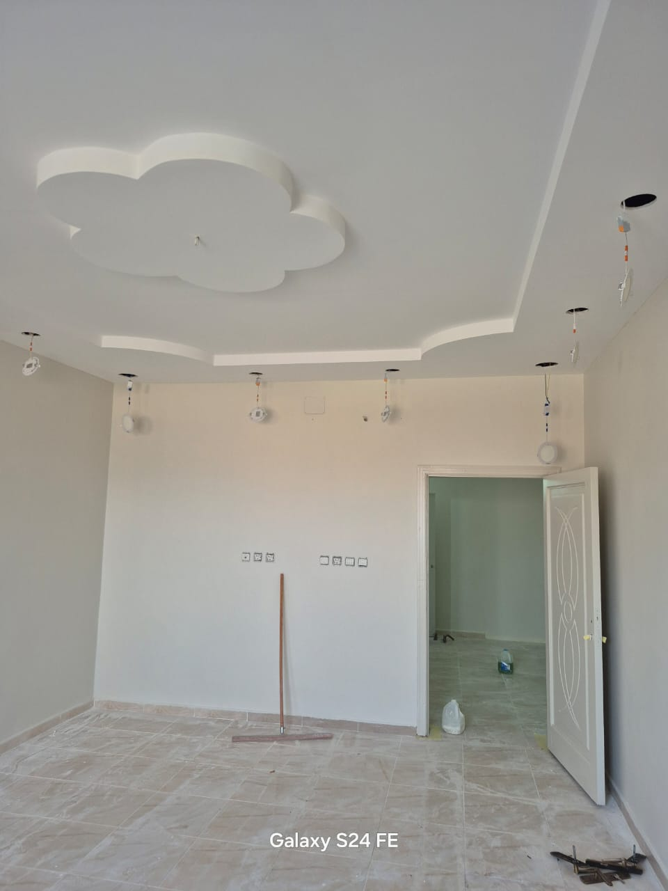

# دهانات الجده - تعليمات تشغيل الموقع

## 📁 هيكل الملفات

```
📂 موقع دهانات الجده/
├── index.html          ← الصفحة الرئيسية
├── projects.html       ← صفحة المشاريع (37 صورة/فيديو)
├── services.html       ← صفحة الخدمات
├── about.html          ← صفحة من نحن
├── contact.html        ← صفحة التواصل
├── style.css           ← ملف التصميم
├── script.js           ← ملف JavaScript
├── placeholder.svg     ← صورة بديلة تلقائية
└── 📂 images/          ← ** ضع صورك هنا **
    ├── 1.jpg
    ├── 2.jpg
    ├── 3.jpg
    ├── ...
    └── 37.jpg
```

## 🖼️ كيفية إضافة الصور

1. أنشئ مجلد باسم `images` داخل مجلد الموقع
2. ضع صورك بأسماء:
   - `1.jpg` , `2.jpg` , `3.jpg` ... حتى `37.jpg`
3. الصور ستظهر تلقائياً في صفحة المشاريع

## 🎬 إضافة فيديوهات (اختياري)

إذا أردت استبدال أي صورة بفيديو، افتح ملف `projects.html`
وابحث عن رقم الصورة التي تريد استبدالها، ثم استبدل:
```html

```
بـ:
```html
<video src="images/5.mp4" autoplay muted loop playsinline></video>
```

## 📞 معلومات التواصل

- **الهاتف / واتساب**: 0548165421
- الأزرار العائمة موجودة في جميع صفحات الموقع

## 🌟 مميزات الموقع

✅ تصميم فاخر ثيم ذهبي داكن
✅ 5 صفحات كاملة
✅ معرض 37 صورة مع lightbox
✅ فلترة المشاريع بالتصنيف
✅ أزرار عائمة (واتساب + اتصال)
✅ متجاوب مع الجوال
✅ لوادر عند فتح الموقع
✅ تحرك ناعم للعناصر
✅ نافذة تكبير الصور مع التنقل بالسهام

## 🚀 تشغيل الموقع

افتح ملف `index.html` في أي متصفح (Chrome, Firefox, Safari)

---
© 2024 دهانات الجده
